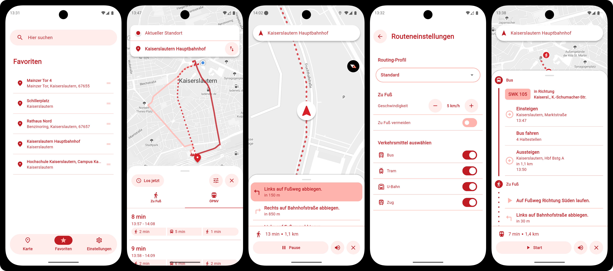
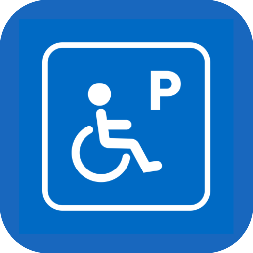
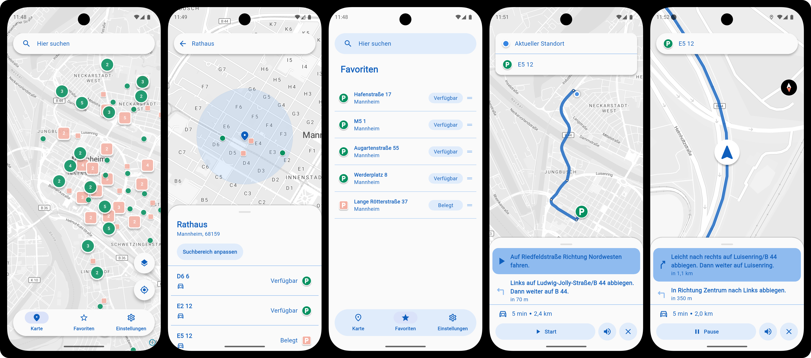

# Navi4All • Multi-modal navigation for everyone

Navi4All is an open-source, multi-modal map & navigation platform for mobile devices. With a focus on modular and customisable design, the app is easy to setup and deploy in new regions.

## Features
- **Map view** of the user's location and nearby Points of Interest (POIs)
- **Place search** including POIs, addresses and streets
- **Favourites** with drag-and-drop sorting
- **Accessibility profiles** with custom settings for different user needs
- **Multi-modal itinerary planning** with mode, speed and accessibility options
- **Step-by-step navigation** instructions with audio-cues and haptic feedback

## Codebase

- **Mobile App**: Cross-platform client for Android and iOS built with Flutter
- **Core Backend**: Python-based backend that integrates data and routing services to expose unified APIs for the mobile app
- **Services**:
    - **OpenTripPlanner**: Multi-modal routing with a focus on transit
    - **Valhalla**: Pedestrian routing with precise step-by-step instructions
    - **Pelias**: Geocoding and autocomplete for place search

## Deployment

### Services
- Fetch required routing data files and place in `services/otp_kl` and `services/valhalla` directories
- Start routing services with Docker Compose: `cd services && docker compose up -d`
- Full instructions: [services/README.md](services/README.md)

### Core Backend
- Copy env template and configure: `cd apps/core_backend && cp .env.example .env`
- Start with Docker: `docker compose up --build`
- Full instructions: [apps/core_backend/README.md](apps/core_backend/README.md)

### Mobile App
Navi4All is currently deployed in the following regions:

- Kaiserslautern, Rhineland-Pfalz (DE) as ***Navi4All***
- Mannheim, Baden-Württemberg (DE) as ***Park-Stark***

#### Setup
- Copy env template and configure: `cd apps/REGIONAL_APP_DIR && cp .env.example .env`
- Run with env defines: `flutter run --dart-define-from-file=.env`
- Full instructions can be found in the respective app directories:
    - Kaiserslautern: [kl_mobile/README.md](apps/kl_mobile/README.md)
    - Mannheim: [ma_mobile/README.md](apps/ma_mobile/README.md)

## Gallery

  
   
  &nbsp;&nbsp;<strong>Navi4All</strong> 
  &nbsp;&nbsp;Kaiserslautern, Rhineland-Pfalz (DE)
    

 

  
   
  &nbsp;&nbsp;<strong>Park-Stark</strong> 
  &nbsp;&nbsp;Mannheim, Baden-Württemberg (DE)
    

&nbsp;&nbsp;

